# Домашняя работа по теме &laquo;сегментация изображений&raquo;

Суркис Антон; Stepik id: [83694640](https://stepik.org/users/83694640)

Графики в директории `diag`,
история обучения моделей (csv) &mdash; в `histories`.
Копия блокнота в корневой директории и в [Google Colab](https://colab.research.google.com/drive/1OaVgaMiDgCaB7hpbfbq8kKqhFQY42byL?usp=sharing)

## Метрики на тестовой выборке:
|   | BCE | Dice | Focal | Correlation |
|---|---|---|---|---|
| **SegNet** | 0.6260000348091126 | 0.71000001430511470 | 0.6860000133514405 | 0.41400000751018523 |
| **UNet**   | 0.7480000376701355 | 0.39400000181049110 | 0.7200000286102295 | 0.49800001978874210 |
| **UNet2**  | 0.4680000126361847 | 0.12400000747293234 | 0.6040000259876251 | 0.43800000548362733 |

Наибольшее значение метрики &mdash; 0.748 &mdash; достигается у UNet BCE.

## Графики каждой функции потерь и соответствующего score для каждой сети
строить их на одной оси бессмысленно, т.к. функции потерь не отнормированы и сходятся в разных точках

### SegNet
#### BCE
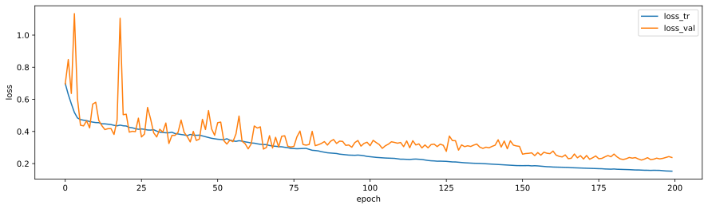  
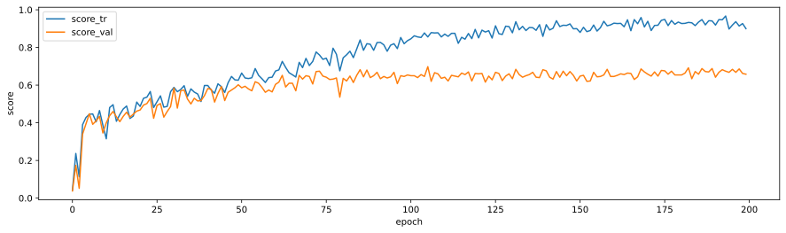
#### Dice
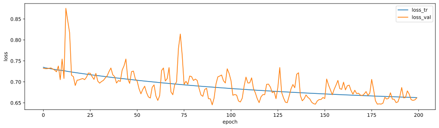  
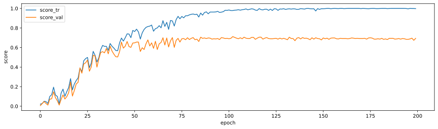
#### Focal
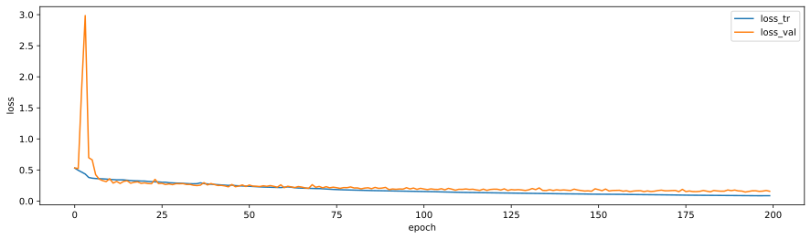  
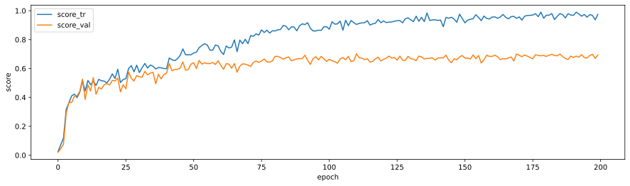  
Посмотрим внимательнее на функцию потерь после первых эпох, чтобы убедиться, что она уменьшается, т.к. это не видно из-за масштаба:  
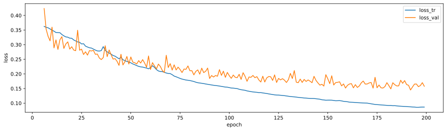
#### Correlation
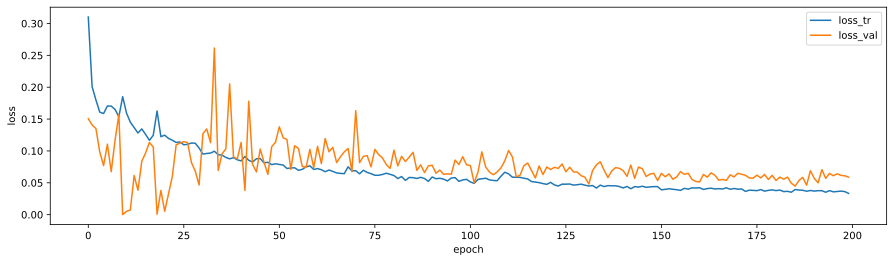  
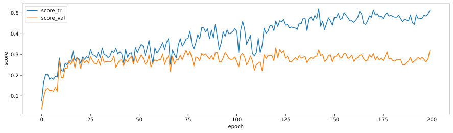

### UNet
#### BCE
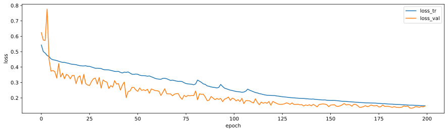  
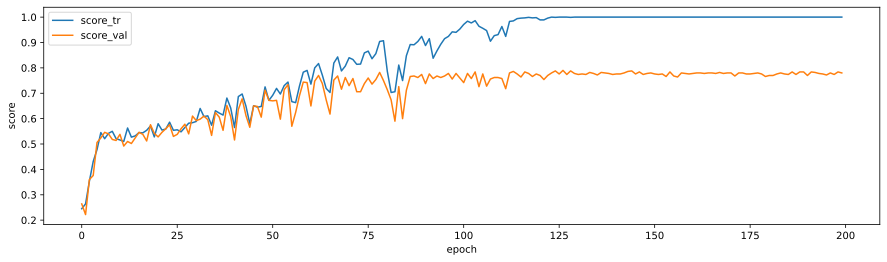
#### Dice
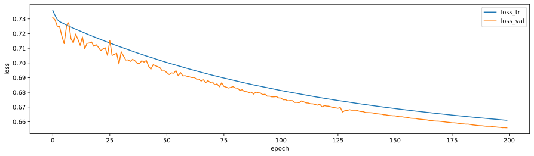  
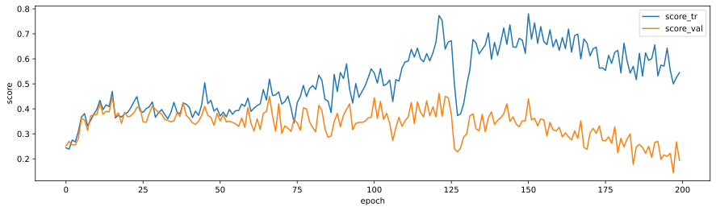
#### Focal
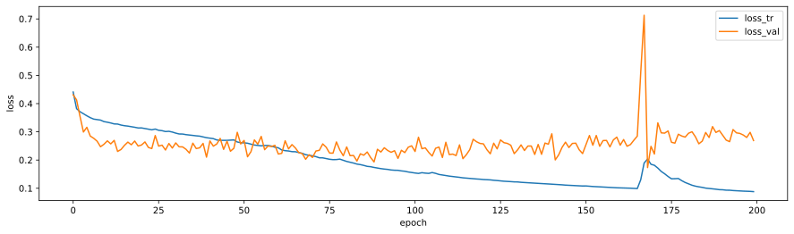  
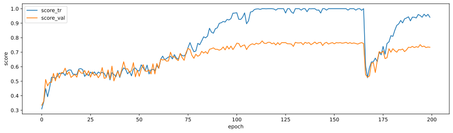  
Здесь можно заметить скачок метрики и функции потерь.
Предположительная причина: накопленный &laquo;импульс&raquo; оптимизатора
и высокое значение градиента функции потерь в локальной точке приводят к подобному &laquo;выхлопу&raquo;.

#### Correlation
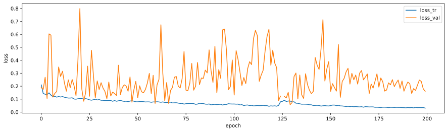  
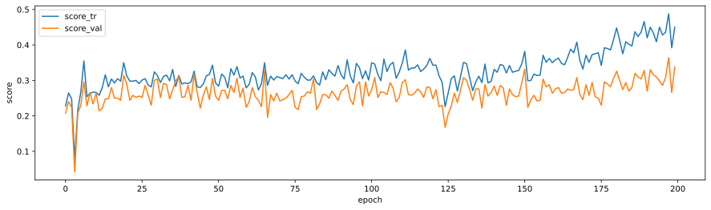

### UNet2
#### BCE
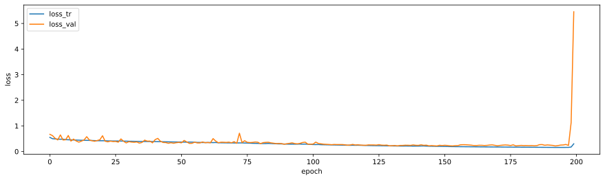  
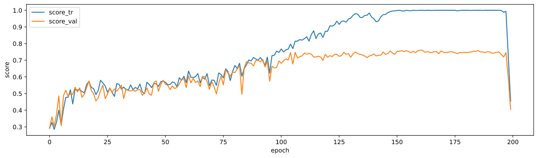  
Здесь заметен аналогичный скачок оптимизатора, в этот раз он пришелся ровно на 200-ю эпоху обучения.
Однако, сравнивая графики (позже) можно увидеть, что UNet2 все равно проигрывает UNet при обучении с функцией потерь BCE.

Построим график функции потерь без двух последних эпох,
т.к. на предыдущем не видно, что она уменьшается из-за масштаба:  
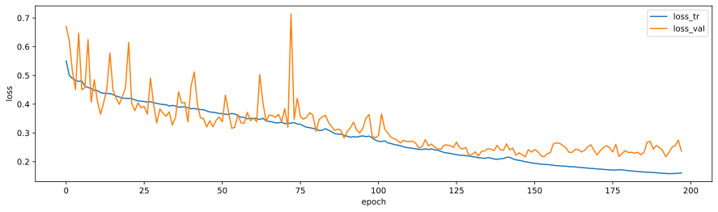
#### Dice
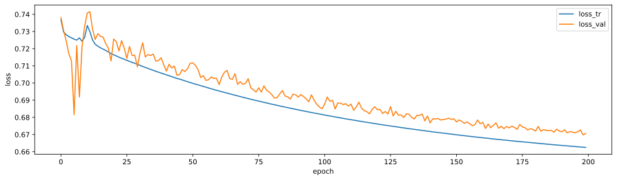  
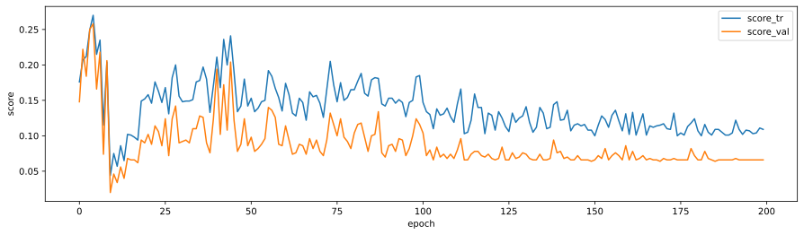
#### Focal
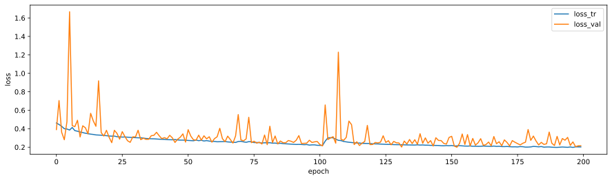  
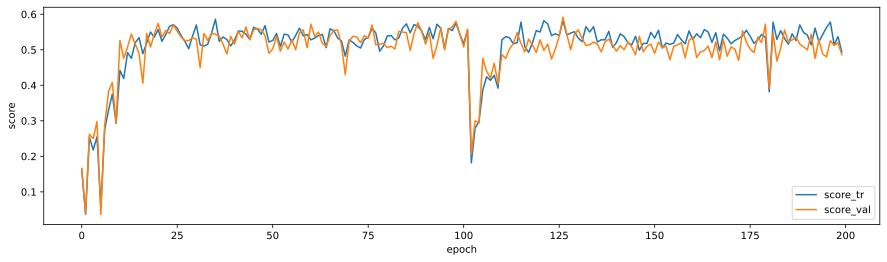
#### Correlation
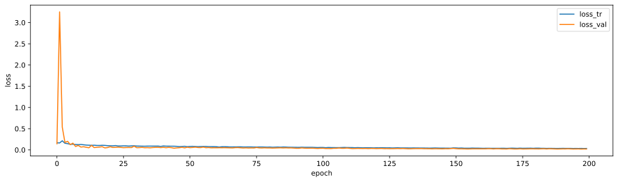  
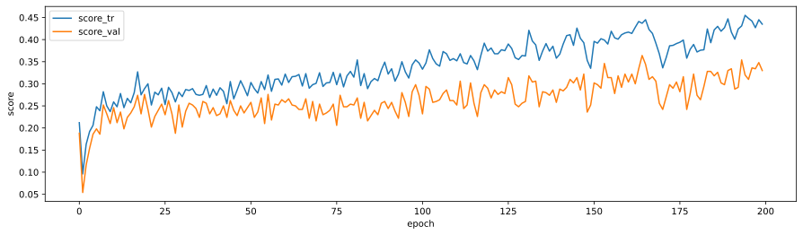  
Снова построим график функции потерь только по части эпох,
на этот раз &laquo;откусывая&raquo; начало:  
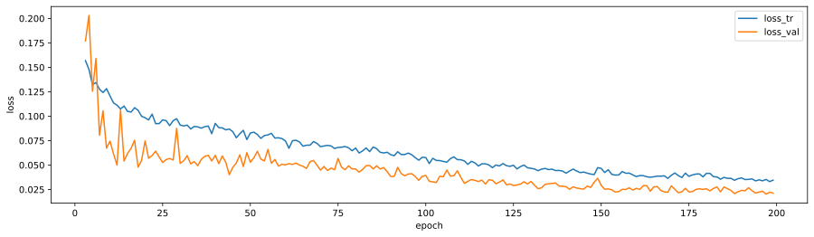  
Можно заметить, что снижение функции потерь в целом происходит,
но слишком медленно для практического применения.

**У всех моделей наблюдается значительное переобучение**

## Графики метрик
Метрики уже имеет смысл сравнивать, т.к. используем одну и ту же метрику как эталон оценки качества модели.
При этом по предполагаемым условиям график мы можем построить только по валидационному,
но не тестовому датасету, поскольку возможности взять метрики по последнему во время обучения обычно нет.

### По сетям
#### SegNet
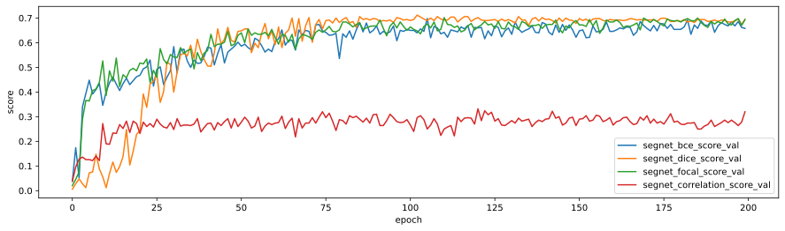
#### UNet
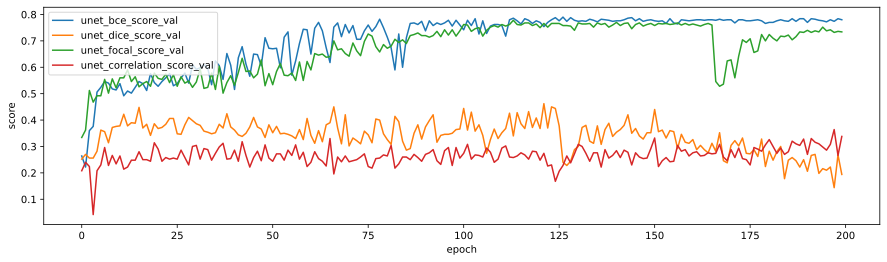
#### UNet2
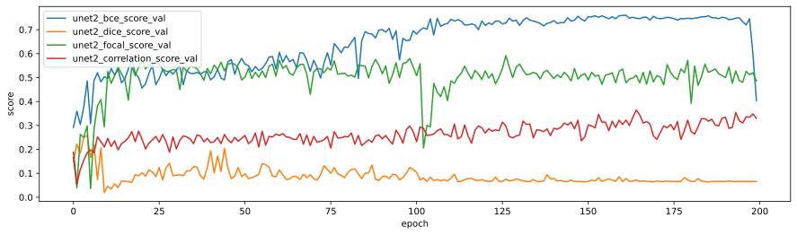

### По функциям потерь
#### BCE
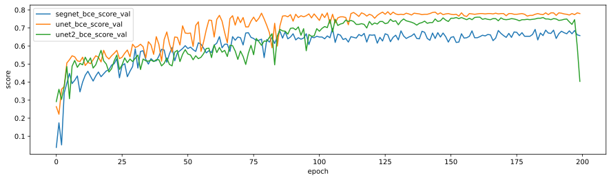  
Можно заметить, что UNet показывает лучший счет с BCE, около 0.8,
немного отстает UNet2, но на последней эпохе &laquo;глупеет&raquo;.
Эта аномалия не влияет на то, что UNet2 проигрывает UNet,
но полезно учитывать возможность подобных аномалий и важность построения именно графика,
а не только сравнивания последних значений при, например, выборе, какую нейросеть обучать,
на большем количестве эпох или большем датасете,
что невозможно сделать для всех сетей в силу ограниченности ресурсов.
SegNet показывает стабильный score, но сильно ниже UNet.
#### Dice
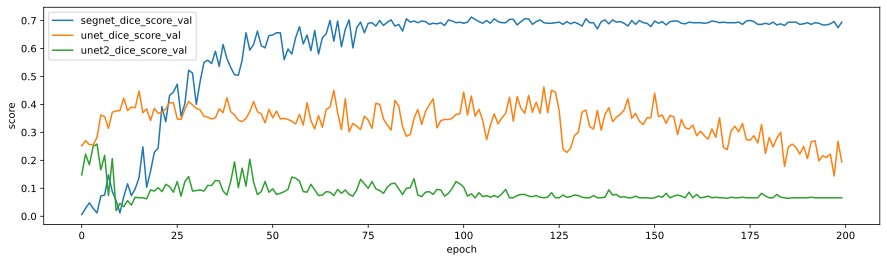  
С Dice наилучший счет показывает SegNet, около 0.7,
UNet и UNet2 почти не обучаются.
#### Focal
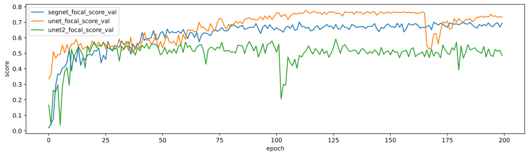  
Лучший score при фокусной функции потерь &mdash; у UNet, но при этом между 150 и 175 эпохой происходит значительный провал.
UNet2 сильно отстает, SegNet стабилен, но тоже отстает.
#### Correlation
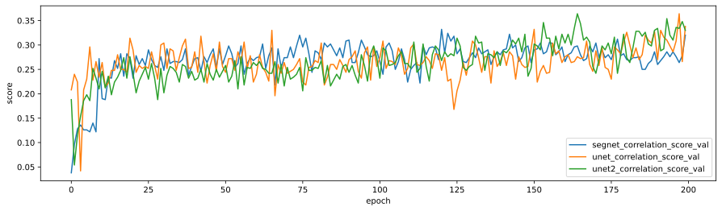  
Correlation score нестабилен у всех трех сетей, и показывает слабый результат.
Возможно, это связано с тем, что он предназначен для менее четкой сегментации,
но т.к. здесь мы сегментируем поражения кожи, то нужна именно высокая четкость.

## Итоговое сравнение
По предыдущим двум группам наиболее явно ситуацию с метриками отражала группировка по функциям потерь,
поэтому возьмем лучшие сети из этих групп: UNet BCE, SegNet Diccei и UNet Focal
(Correlation можно не брать, т.к. явно видно слишком низкий счет).
Стоит отметить, что эти же модели выдают наиболее четкие карты сегментации,
что можно видеть в визуализации их обучения.  
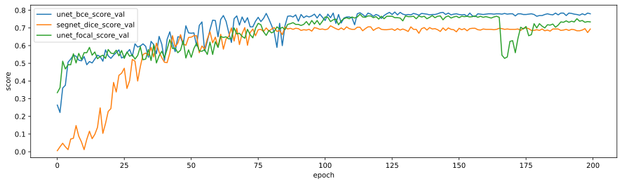  
UNet с Focal loss в целом сравним по качеству с UNet BCE,
но из графика видно, что все же немного отстает даже до проседания.
SegNet Dice значительно отстает от обоих, хотя и был лучшим в своей группе.

## Вывод
Наилучшей нейросетью для задачи сегментации поврежденных участков кожи оказалась UNet (с пулингами),
обученная с функцией потерь BCE, как по метрикам на тестовом датасете (отображены снизу от графиков функций потерь) &mdash; 0.748,
что является лучшим результатом, так и по графикам метрик потерь на валидационном датасете
&mdash; модель явно опережает остальные на валидационном датасете.

Приблизительное время обучения до сходимости у всех сетей на всех функциях потерь в данном задании
&mdash; 125-150 эпох. Я брал 200, т.е. со значительным запасом, поскольку проводил исследование и этой информации у меня еще не было.

Во время анализа графиков я обнаружил аномалию &laquo;выброса&raquo; модели из локального минимума функции потерь при оптимизации,
это нужно учитывать при выборе модели для дальнейшего обучения в других проектах.